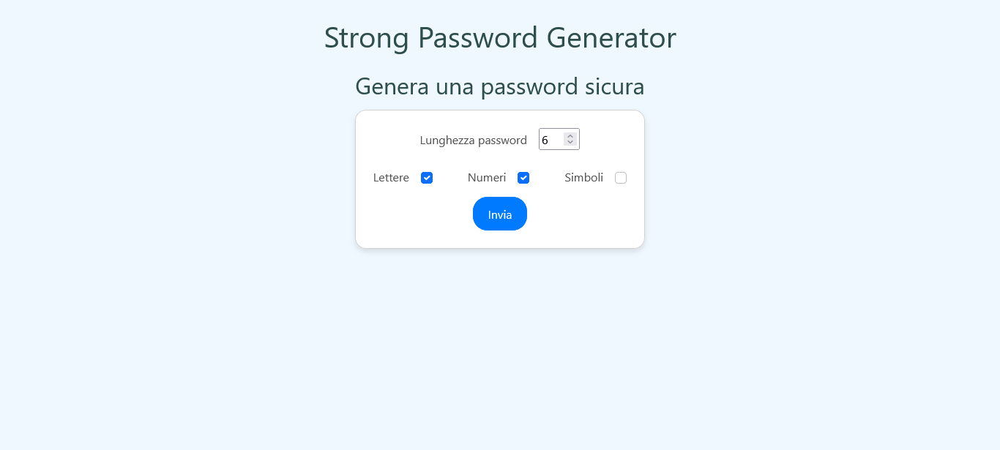
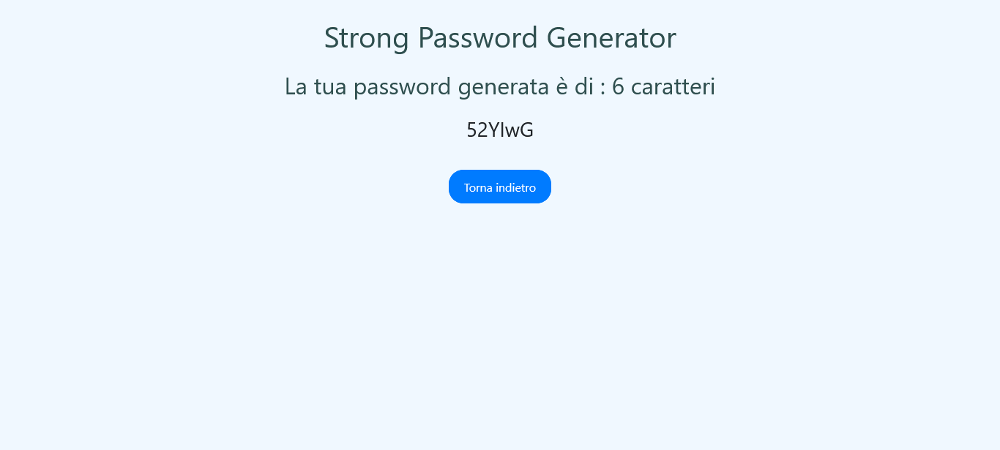

# PHP Password Generator

## Descrizione

Progetto PHP per la generazione di password sicure e personalizzabili.

L'applicazione:
- Mostra un **form** per configurare la password.
- Permette la **generazione** di una password casuale.
- Utilizza **Bootstrap 5** per uno stile moderno e responsive.
- Reindirizza l’utente a una pagina dedicata con la password generata.

---

## Tecnologie

- **PHP** (core backend e gestione sessione)
- **HTML5**
- **Bootstrap 5** (stile responsive e componenti)

---

## Struttura Funzionale

- **Form** con metodo GET che include:
  - Campo numerico per definire la **lunghezza** della password.
  - Checkbox per includere **lettere**, **numeri** e **simboli**.
- File `functions.php` con la funzione `createPassword()`.
- File `result.php` che mostra la password generata.
- Utilizzo delle **sessioni PHP** per salvare la password.

---

## Come Funziona

1. L’utente apre la pagina `index.php`.
2. Inserisce:
   - La **lunghezza** desiderata della password (tra 4 e 15).
   - Le opzioni di caratteri da includere (**lettere**, **numeri**, **simboli**).
3. Clicca su "Invia" e viene reindirizzato a `result.php`.
4. Viene mostrata la password generata in modo casuale, in base alle opzioni scelte.

---

## Esempi di Uso

- Lunghezza 10, solo lettere: `fJdhsKrtVe`
- Lunghezza 8, lettere e numeri: `H7u3eK29`
- Lunghezza 12, tutto incluso: `!Ae93@Kp12#Q`

---

## Screenshot

  

---

## Note

- Se **nessuna opzione** è selezionata, la password viene generata usando **tutti** i tipi di caratteri.
- La password viene salvata nella variabile `$_SESSION['password']`.
- Il form accetta solo lunghezze **tra 4 e 15 caratteri**.

---

## Bonus

- ✅ **Redirect** alla pagina `result.php` per visualizzare il risultato.
- ✅ **Scelta dei caratteri** tramite checkbox.
- ✅ **Gestione sessioni** per salvare i dati.
- ✅ **Stilizzazione** con Bootstrap 5.

---

